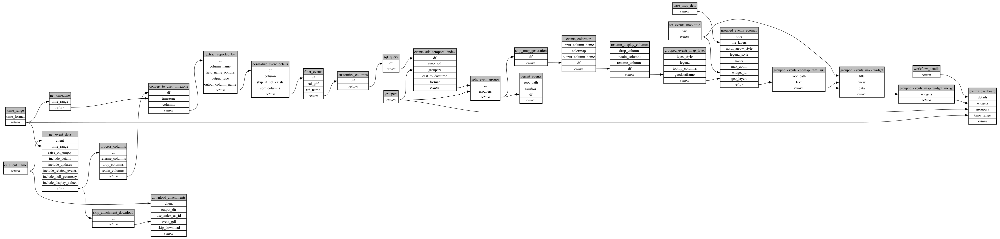

```
# AUTOGENERATED BY ECOSCOPE-WORKFLOWS; see fingerprint in README.md for details

```

```yaml
# fingerprint:
artifacts_sha256_basic: f881dc286bbc38886e7971b4231efece215b9e7227acef95d529d9e601b50d28
artifacts_sha256_strict: 15dc7cba0cf265fc60c33d64c859518af0b0e12e09598a81e586bf16de91aafb
installed_requirements:
- channel: https://repo.prefix.dev/ecoscope-workflows/
  name: ecoscope-workflows-core
  version: {version: ==0.22.12}
- channel: https://repo.prefix.dev/ecoscope-workflows/
  name: ecoscope-workflows-ext-ecoscope
  version: {version: ==0.22.12}
- channel: https://repo.prefix.dev/ecoscope-workflows-custom/
  name: ecoscope-workflows-ext-custom
  version: {version: ==0.0.28}
params_sha256: 6f4849c47313bca907762a775f37abf029ae367b3a1cd4c615c8790a4116acdc
spec_sha256: 58a774ee6d485acb904638ab2358f36f2fdfa98a066c3ed71cf596939bf00d80

```

# ecoscope-workflows-download-events-workflow


