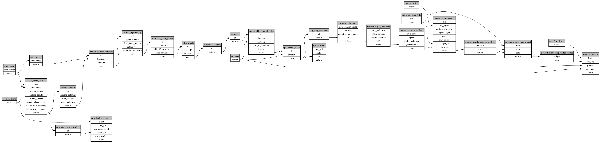

```
# AUTOGENERATED BY ECOSCOPE-WORKFLOWS; see fingerprint in README.md for details

```

```yaml
# fingerprint:
artifacts_sha256_basic: 3fa0e0c47a1159624f4e26b272b6e6dc575e5668bf00b9117e91d914e63e110c
artifacts_sha256_strict: 180e854185badf7214e792ece99d2b595c50d1082ab53b1730825e0f67b437dc
installed_requirements:
- channel: https://repo.prefix.dev/ecoscope-workflows/
  name: ecoscope-workflows-core
  version: {version: ==0.22.14}
- channel: https://repo.prefix.dev/ecoscope-workflows/
  name: ecoscope-workflows-ext-ecoscope
  version: {version: ==0.22.14}
- channel: https://repo.prefix.dev/ecoscope-workflows-custom/
  name: ecoscope-workflows-ext-custom
  version: {version: ==0.0.34.dev47+g21b717ec2}
params_sha256: 6428c8557b5d45638fd5cf4d61b81db54b795e578740d9344fb15784f8dc27cf
spec_sha256: 24d98df4edf412530503ac8c7869291feb9b1812359b3edebc44a37c368c5b86

```

# ecoscope-workflows-download-events-workflow


