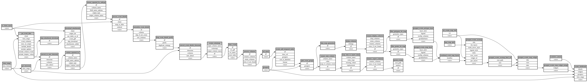

```
# AUTOGENERATED BY ECOSCOPE-WORKFLOWS; see fingerprint in README.md for details

```

```yaml
# fingerprint:
artifacts_sha256_basic: 
  985162ddc33128f6123173cfd03f04c9b6d2e1560f311ace2e77e3b783f5e9d4
artifacts_sha256_strict: 
  e098a5c048c22d2ee30f0abd77ae631f83c318578208aa87c71834590f875a8e
installed_requirements:
- channel: https://repo.prefix.dev/ecoscope-workflows/
  name: ecoscope-platform
  version: {version: ==2.11.14}
- channel: https://repo.prefix.dev/ecoscope-workflows-custom/
  name: ecoscope-workflows-ext-custom
  version: {version: ==0.1.0rc3}
params_sha256: 3229dd47f31447884b2e79e8d056c4a9e0870d415a07a8669c3e999d85bd76e4
spec_sha256: 4090ffaf3ed6eb19b75741c027229f966103a4a6cb1d695fa1613407189fba46

```

# ecoscope-workflows-download-events-workflow


