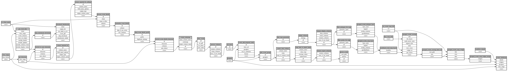

```
# AUTOGENERATED BY ECOSCOPE-WORKFLOWS; see fingerprint in README.md for details

```

```yaml
# fingerprint:
artifacts_sha256_basic: 467e9d99ff322bcd7a4c4515ce79016eaeb88bf1f202fce6a7981f0e78486966
artifacts_sha256_strict: 9eec866e83a7942cc0496c1560dd994a5f1897a0155670c0691719a3e8d1be5c
installed_requirements:
- channel: https://repo.prefix.dev/ecoscope-workflows/
  name: ecoscope-platform
  version: {version: ==2.23.0}
- channel: conda-forge
  name: pydeck
  version: {version: ==0.9.2}
params_sha256: 0fe6f1529e5aa82641f3793a0d9c384893d54baee10556c29f0ef752f8ff130a
spec_sha256: bf250aba6d70a18efc8583e1ed7df86210b70f46901fc81d10a6266fa4bb397c

```

# ecoscope-workflows-download-events-workflow


