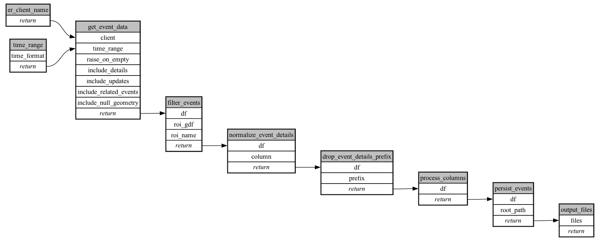

```
# AUTOGENERATED BY ECOSCOPE-WORKFLOWS; see fingerprint in README.md for details

```

```yaml
# fingerprint:
artifacts_sha256_basic: 7917d03af7bd828f26b38f02a277b810e36f4d58983323fc6642d86a9b7701fe
artifacts_sha256_strict: df074bea3d1b43f1422be7817294f5963fb8df6c8da1fe3c0a1b892337305105
installed_requirements:
- channel: https://repo.prefix.dev/ecoscope-workflows/
  name: ecoscope-workflows-core
  version: {version: ==0.18.1.dev2+gcf3c582cb}
- channel: https://repo.prefix.dev/ecoscope-workflows/
  name: ecoscope-workflows-ext-ecoscope
  version: {version: ==0.18.1.dev2+gcf3c582cb}
- channel: https://repo.prefix.dev/ecoscope-workflows-custom/
  name: ecoscope-workflows-ext-custom
  version: {version: ==0.0.8.dev2+g1913a0d32.d20251204}
params_sha256: ffb97cfc9d1a7b1811b3acefef6bc0b685e3a838a37987ea972cc287d830d1be
spec_sha256: 3d34232961a742f07ca083b09dd7f0acbe7030872f933857dc9dad3d603394e8

```

# ecoscope-workflows-er-events-workflow


